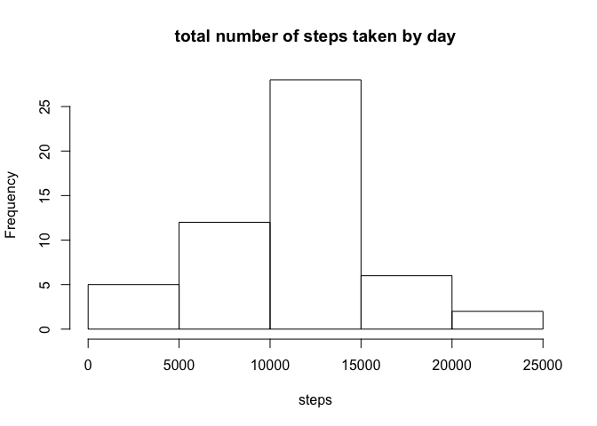
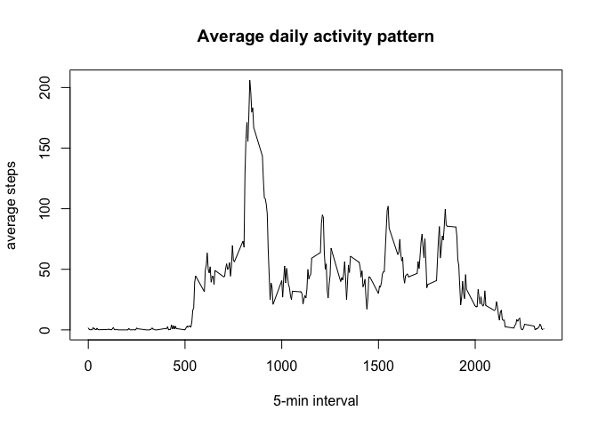
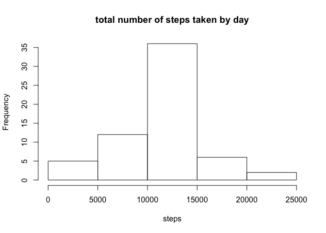

# Reproducible Research: Peer Assessment 1


## Loading and preprocessing the data
###Load the data

```r
data  <- read.table(unz("activity.zip","activity.csv"),header=TRUE,sep=",")
```
###Transform data

```r
data$date  <- as.Date(data$date,format="%Y-%m-%d")
library(lattice)
library(knitr)
```
## What is mean total number of steps taken per day?
###histogram of the total number of steps taken each day

```r
stepsperday  <- aggregate(steps~date,data=data,sum,na.rm=TRUE)
hist(stepsperday$steps,main="total number of steps taken by day",xlab="steps")
```

 
### mean and median

```r
mean(stepsperday$steps)
```

```
## [1] 10766.19
```

```r
median(stepsperday$steps)
```

```
## [1] 10765
```
## What is the average daily activity pattern?

```r
dataaverage  <- aggregate(steps~interval,data=data,mean,na.rm=TRUE)
plot(dataaverage$interval,dataaverage$steps,type="l",xlab="5-min interval",ylab="average steps",main="Average daily activity pattern")
```

 
###Which 5-minute interval, on average across all the days in the dataset, contains the maximum number of steps?

```r
maxinterval  <- dataaverage[which.max(dataaverage$steps),1]
maxinterval
```

```
## [1] 835
```

## Imputing missing values
###Calculate number of missinve values

```r
data_na  <- sum(is.na(data))
data_na
```

```
## [1] 2304
```
###Filling NAs

```r
datanafilled  <- numeric()
for(i in 1:nrow(data)) {
        dataset  <- data[i,]
        if(is.na(dataset$steps)) {
                steps  <- subset(dataaverage,interval == dataset$interval)$steps
        }
        else {
                steps  <- dataset$steps
        }
        datanafilled  <- c(datanafilled,steps)
}
```
###new dataset

```r
newdata  <- data
newdata$steps  <- datanafilled
newstepsperday  <- aggregate(steps~date,data=newdata,sum,na.rm=TRUE)
```
###new histogram and compare mean&median

```r
hist(newstepsperday$steps,main="total number of steps taken by day",xlab="steps")
```

 

```r
mean(newstepsperday$steps)
```

```
## [1] 10766.19
```

```r
median(newstepsperday$steps)
```

```
## [1] 10766.19
```

```r
meandifference  <- mean(newstepsperday$steps)-mean(stepsperday$steps)
meandifference
```

```
## [1] 0
```

```r
mediandifference  <- median(newstepsperday$steps)-median(stepsperday$steps)
mediandifference
```

```
## [1] 1.188679
```
### mean is the same and median has a little bit different
## Are there differences in activity patterns between weekdays and weekends?


```r
dayfactor  <- weekdays(newdata$date)
newdata$daylevel  <- as.factor(ifelse(dayfactor %in% c("Saturday","Sunday"),"weekend","weekday"))
stepsbyday_need  <- aggregate(steps~interval+daylevel,data=newdata,mean)
xyplot(steps~interval|daylevel,stepsbyday_need,type="l",xlab="Interval",ylab="Number of steps",layout=c(1,2))
```

 

